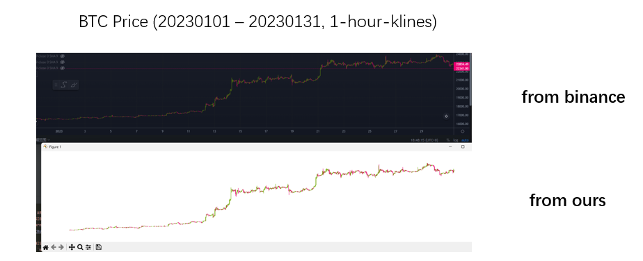
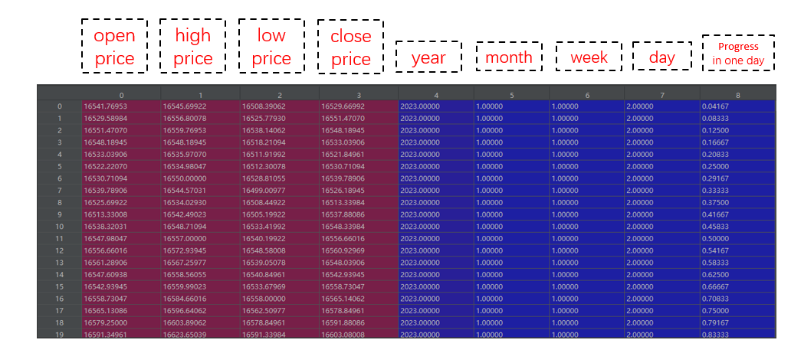

# BTC Dataset
An efficient tool to capture historical price data of cryptocurrencies

## Introduction
We provide a variety of cryptocurrency transaction pair data for academic and commercial purposes, such as LSTM sequence prediction, quantitative trading, trend analysis, and more. Data is synchronized with binance stock.
Take btc prices, for example:

## Data Format
We provide data download service. The data size is Nx9 (N is the sequence length) and the precision is float32. The downloaded binary file can be converted to numpy array by referring to load_data.py script. The structure of the data includes open,high,low,close prices and strict timestamp alignment.

## Obtain Data
### Step 1: get download service
Please contact the administrator email wangwei960418@gmail.com to purchase SECRET to get the download service, in addition we offer 5 free trial opportunities.
See buy_secret.txt for details.

### Step 2: download
Run the following command to start the download:
    
    Usage: 
    python client.py <secret> <symbol> <start_date> <end_date> <interval>
    
    <secret>: Contact the administrator to obtain download service
    <symbol>:transaction pair, e.g., BTCUSDT, ETHUSDT, NEARUSDT etc.
    <start_date>: the starting date, YEAR_MONTH_DAY
    <start_date>: the endding date, YEAR_MONTH_DAY
    <interval>: the sampling unit, we provide: 1min:1, 15min:15, 30min:30 1h:60, 4h:240 

for example, getting btc 1h kline data:
 
    python client.py KEIXkYPgcpRaCGZe BTCUSDT 2020_01_01 2023_01_31 60
    python client.py KEIXkYPgcpRaCGZe DOGEUSDT 2020_01_01 2023_01_31 60

You can try it for free (data after 2022 only)
    
    python client.py test BTCUSDT 2023_01_01 2023_01_31 60

The default location for downloading data is./data.bin. You can modify client.py to specify the location

    s = CLIENT("43.163.226.97",9999,savefile="./data.bin")
### Step 3: check data

Then, you can then check the data using the python platform

    python load_data.py ./data.bin

## Technical Support

The data service is provided by DBC Team, a hobbyism group dedicated to the research of investment transactions based on deep learning algorithm. The members of the organization come from Google, Microsoft, biance, coinbase, grayscale, etc. Welcome the colleagues with relevant background to join us!